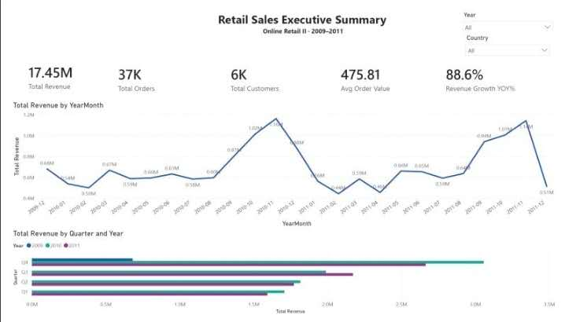
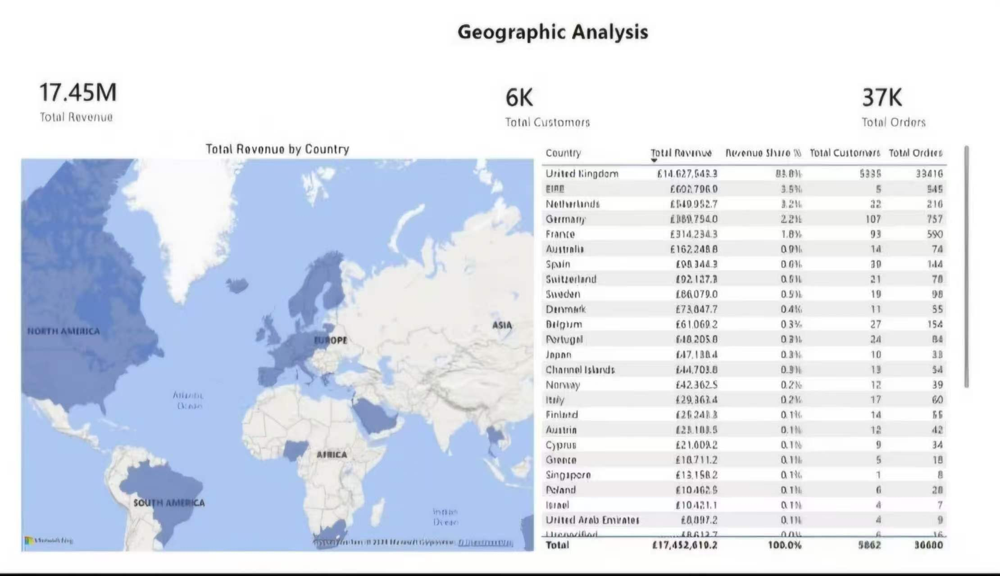
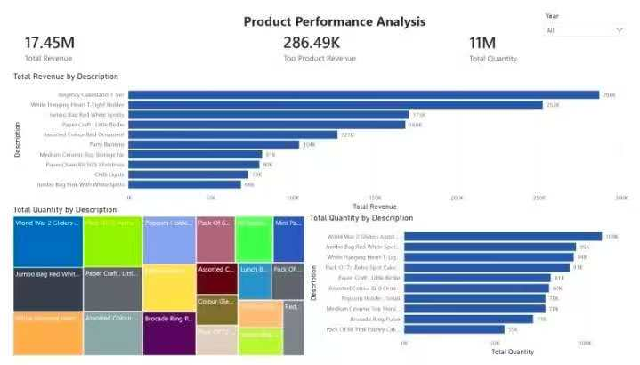
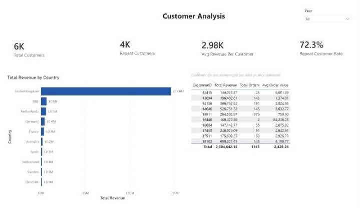
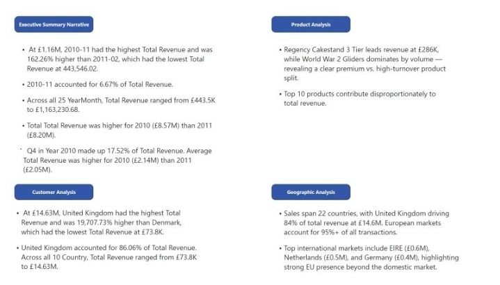

# Retail Sales Power BI Dashboard

A Power BI dashboard developed to help retail stakeholders monitor sales performance, analyze customer purchasing behavior, identify top-performing products, and evaluate geographic sales distribution.

---

# Project Summary

| Item | Details |
|------|---------|
| Industry | Retail |
| Role | Power BI Developer |
| Dashboard Type | Executive Sales Dashboard |
| Audience | Sales Managers, Business Stakeholders |
| Tools | Power BI, Power Query, DAX, Excel |
| Data Source | Kaggle Online Retail Sales Dataset (2009–2011) |
| Skills | Data Modeling, KPI Design, Business Analysis, Data Visualization |

---

# Dashboard Preview

## Executive Summary

--Provides an executive overview of revenue, orders, customers, average order value, and revenue growth trends.

## Geographic Analysis

--Analyzes revenue distribution across countries and highlights key international markets.

## Product Performance Analysis

--Compares top-performing products by revenue and sales volume to identify product opportunities.

## Customer Analysis

--Evaluates customer revenue, repeat purchase behavior, and average customer value.

## Business Narrative

--Summarizes the most important business insights and recommendations derived from the dashboard. 

---

# Business Problem

Retail organizations often rely on multiple reports to evaluate sales performance, customer behavior, and product performance. This makes it difficult for business stakeholders to identify trends and make timely decisions.

This dashboard consolidates key business metrics into a single interactive report, enabling faster and more informed business decisions.

---

# Business Questions

This dashboard helps answer key business questions such as:

- How is revenue changing over time?
- Which countries generate the highest revenue?
- Which products contribute the most revenue?
- Which products have the highest sales volume?
- How many customers are repeat customers?
- What is the average revenue per customer?
- Which markets drive overall business growth?

---

# Key Insights

- Revenue peaked during Q4, highlighting strong seasonal demand.
- The United Kingdom generated the majority of total revenue, while international markets provided additional growth opportunities.
- High-revenue products differed from high-volume products, revealing premium versus high-turnover product strategies.
- More than 70% of customers were repeat customers, indicating strong customer retention.
- Revenue trends revealed clear seasonal purchasing patterns throughout the analysis period.

---

# Data Preparation

- Imported the Kaggle Online Retail Sales Dataset.
- Cleaned and transformed transaction data using Power Query.
- Removed cancelled and invalid transactions.
- Standardized customer and product information.
- Built a star schema data model.
- Created KPI measures using DAX.
- Designed an interactive Power BI dashboard for business users.

---

# Tools Used

- Power BI
- Power Query
- DAX
- Excel

---

# Data Source

Primary Dataset

- Kaggle Online Retail Sales Dataset

Analysis Period

- December 2009 – December 2011

---

# Skills Demonstrated

- Data Cleaning
- Data Transformation
- Data Modeling
- DAX Development
- KPI Dashboard Design
- Executive Reporting
- Business Storytelling
- Interactive Dashboard Design

---

# Business Value

This dashboard provides business stakeholders with a centralized view of sales performance, customer behavior, product performance, and geographic trends. It enables faster decision-making by transforming raw transaction data into actionable business insights.

---

# Future Improvements

- Customer Segmentation (RFM Analysis)
- Sales Forecasting
- Inventory Optimization
- Profitability Analysis
- Power BI Service Deployment
- Automated Data Refresh
